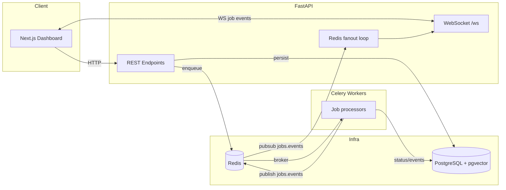

# Queuely

Queuely is a **distributed task processing + operations dashboard** that combines a classic queue/worker stack (FastAPI + Celery + Redis + Postgres) with **real-time job status via WebSockets** and an **AI “debug sessions” surface** backed by Postgres + pgvector (message memory + codebase-context retrieval).

If you’re a recruiter or hiring manager: this project is meant to demonstrate end-to-end backend engineering—API design, async processing, retries/DLQ, durable state modeling, real-time event transport, and a small RAG-style subsystem—wired together into a runnable local platform.

## What You Can Do With It

- Submit async jobs (`pdf_processing`, `report_generation`, `email_sending`, `custom`) and track their lifecycle durably in PostgreSQL.
- Get **live job updates** in the UI via WebSockets (with optional replay from a timestamp).
- Operate the system via an **ops API** (queue depth, worker health, dead-lettered jobs, requeue).
- Create AI debug sessions where messages are persisted and semantically retrieved using **pgvector**.
- Upload source files for “codebase context” ingestion (chunking + embeddings stored in Postgres) and get provenance of which chunks/messages were referenced by an AI response.

## Architecture (High Level)



More detail (diagrams + flows): `docs/PROJECT_GUIDE.md` and `docs/architecture.md`.

## Monorepo Layout

- `backend/`: FastAPI API, Celery worker, DB models, Alembic migrations
- `frontend/`: Next.js dashboard (jobs + sessions + uploads)
- `infra/`: Docker Compose + Postgres init scripts (pgvector)
- `docs/`: Architecture, schema notes, and build checklist

## Local Development (Docker)

Start everything (Postgres + Redis + API migrations + API + worker + frontend):

```powershell
docker compose -f infra/docker-compose.yml up --build
```

Open:
- API docs (Swagger): `http://localhost:8000/docs`
- Frontend: `http://localhost:3000`

Notes:
- Migrations run automatically via the `api-migrate` service (see `infra/docker-compose.yml`).
- The WebSocket endpoint is `ws://localhost:8000/ws` (token required via query param or `Authorization: Bearer ...` header).

## Key APIs (Map)

- Auth: `POST /auth/register`, `POST /auth/login`, `POST /auth/refresh`, `POST /auth/logout`, `GET /auth/me`
- Jobs: `POST /jobs`, `GET /jobs`, `GET /jobs/{job_id}`, `POST /jobs/{job_id}/cancel`
- Ops (superuser): `GET /ops/queues`, `GET /ops/workers`, `GET /ops/jobs`, `GET /ops/jobs/{job_id}`, `GET /ops/jobs/dead-lettered`, `POST /ops/jobs/{job_id}/requeue`
- AI sessions: `POST /sessions`, `GET /sessions`, `GET /sessions/{id}`, `POST /sessions/{id}/messages`, `GET /sessions/{id}/messages`, `GET /sessions/{id}/messages/stream`, `POST /sessions/{id}/messages/{message_id}/cancel`
- File RAG: `POST /files`, `POST /files/{file_id}/reindex`, `GET /files`, `DELETE /files/{file_id}`

## Tests

Backend unit tests (local venv):

```powershell
cd backend
.\.venv\Scripts\Activate.ps1
pytest
```

Docker integration tests:

```powershell
make test-docker
```

## Documentation

- “Read me like I’m new here” guide: `docs/PROJECT_GUIDE.md`
- Architecture overview: `docs/architecture.md`
- Database schema notes: `docs/database-schema.md`
- Build checklist / provenance: `docs/build-checklist.md`
