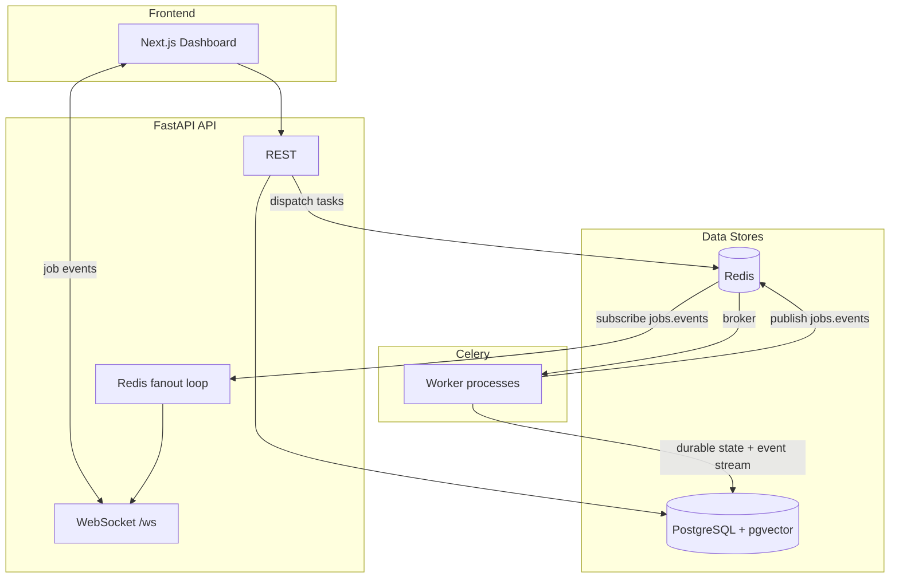
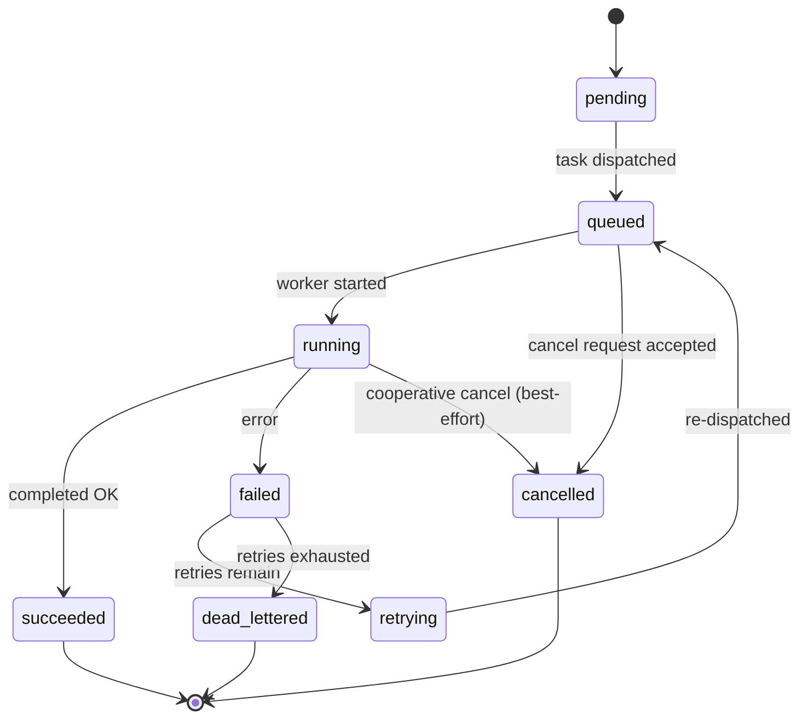

# Queuely Architecture

This document explains how Queuely is wired end-to-end: the services, responsibilities, and the “why” behind key design decisions (durable state, retries/DLQ, and real-time updates).

## Services

- `api`: FastAPI application exposing REST and WebSocket interfaces
- `worker`: Celery workers consuming from Redis queues
- `scheduler`: reserved for periodic workflows and cleanup
- `postgres`: source of truth for users, jobs, events, and worker health
- `redis`: broker, pub/sub transport, and transient coordination layer
- `frontend`: React dashboard for queue visibility and operations

## System Diagram

## Bounded Responsibilities

- HTTP request handling and auth stay in the API service.
- Durable job state stays in PostgreSQL, not only in Celery metadata.
- Celery is responsible for execution, retries, queue routing, and dead-letter handling.
- Redis is treated as operational infrastructure, not the system of record.
- WebSocket fan-out originates from durable state transitions and Redis pub/sub.

## Core Job Lifecycle

1. Authenticated user submits a job via REST.
2. API validates rate limits, persists a `jobs` record, and enqueues a Celery task.
3. Worker transitions the job through `queued`, `running`, `succeeded`, `failed`, or `dead_lettered`.
4. Every important state transition creates a `job_events` row.
5. API/WebSocket subscribers receive status updates based on persisted state.
6. Exhausted retries route the task to a dead-letter queue and mark the job accordingly.

### Job State Machine (Simplified)

## Queue Strategy

- `jobs.default`: general async work
- `jobs.pdf`: PDF and document-heavy workloads
- `jobs.report`: report generation
- `jobs.email`: outbound email tasks
- `jobs.dlq`: dead-letter queue for permanently failed tasks

## Database Design Goals

- Track the business identity of a job separately from Celery internal task ids
- Preserve an auditable event stream for operator debugging
- Keep worker heartbeats queryable for dashboard health checks
- Support per-user rate limiting with persistent token bucket state

## Real-time Updates (WebSockets)

Queuely emits job events from **durable state transitions**, not from “ephemeral” in-memory worker state.

- Workers publish a small JSON event to Redis Pub/Sub channel `jobs.events` when a job transitions.
- The API runs a background “fanout loop” that subscribes to `jobs.events` and forwards events to connected clients.
- The WebSocket endpoint supports optional **replay** using `since=<iso timestamp>`: the server queries `job_events` and replays events created after that time for the authenticated user.

This design makes WebSocket delivery best-effort (as it should be), while correctness remains anchored in PostgreSQL.
